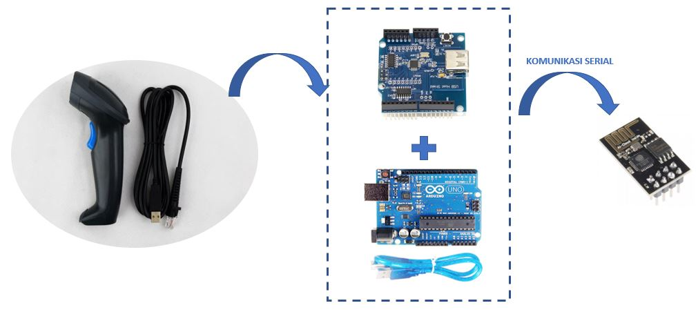

# IoT-BarcodeScanner
IoT Barcode Scanner merupakan sebuah sistem berbasis Internet of Things yang digunakan untuk melakukan scan terhadap barcode dan mengirimkan data yang didapat ke web server menggunakan ESP8266 dan Arduino.

## Peralatan yang dibutuhkan :
1. [Barcode Scanner](images/BARCODE_SCANNER_BISON_BI_1058_1D.jpg)
2. [Arduino UNO](images/arduino%20uno.png)
3. [USB HOST SHIELD 2.0](images/USB-Host-Shield-2-0.jpg)
4. [ESP8266-01](images/ESP8266-01.jpg)
5. [Kabel Jumper](images/jumper.jpg)

## Prinsip Kerja Alat

